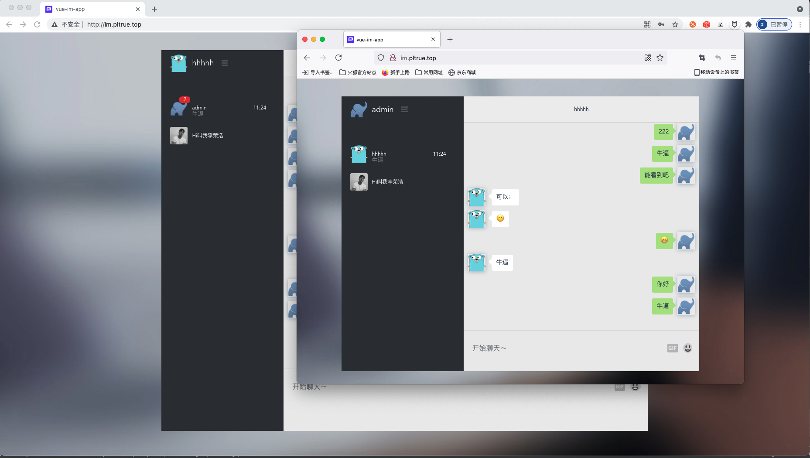
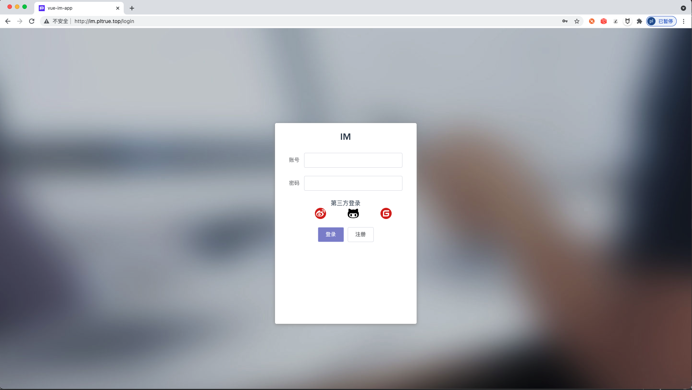
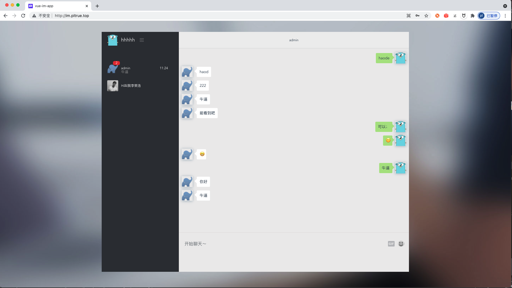
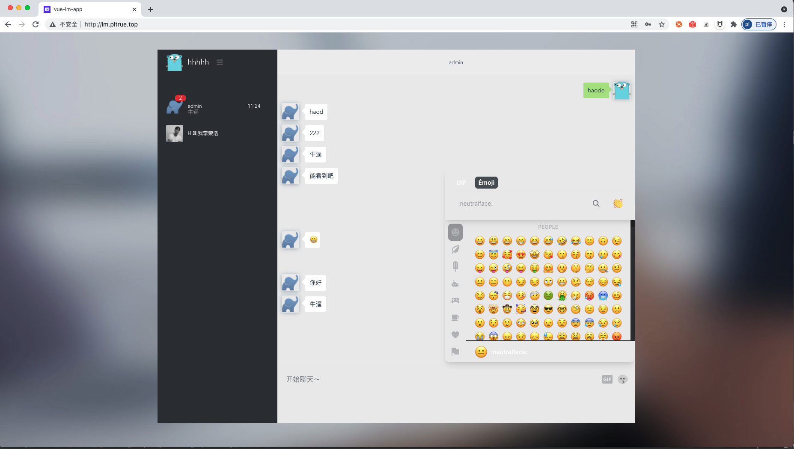

## GoIm

<p align="center">
<a href=""></a> 
</p>

> 这是一个由golang+vue编写的web IM应用服务端 📦📦📦


#### 简单的功能

   - [x] 支持微博登录
   - [x] 端对端消息推送
   - [x] 支持离线消息推送
   - [ ] 创建群聊
   - [ ] 群聊消息推送
   - [x] 消息提醒功能
   - [x] 响应式的前端界面支持pc与h5
   
#### 效果图
  * 聊天

  * 登录页

  * 主页面

  * 主页面


#### [前端源码](https://github.com/pl1998/web-im-app)

#### 简单部署
```shell script
cp .env.example .env
go run main.go 或者 air
```

#### 图床
```shell script
https://sm.ms/register
```

