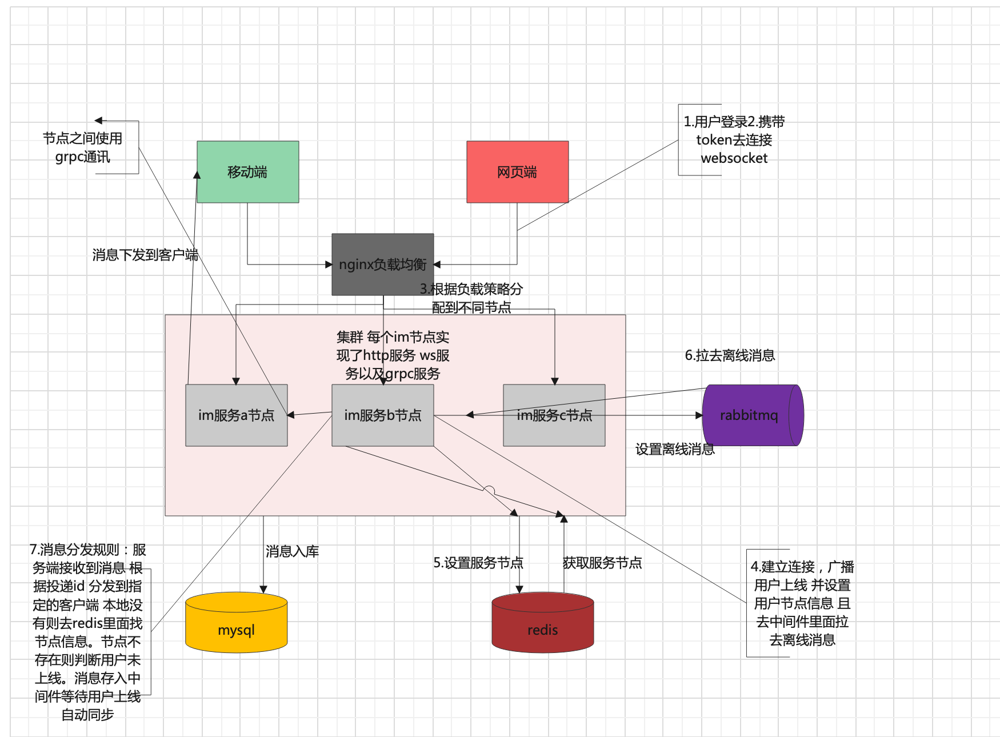
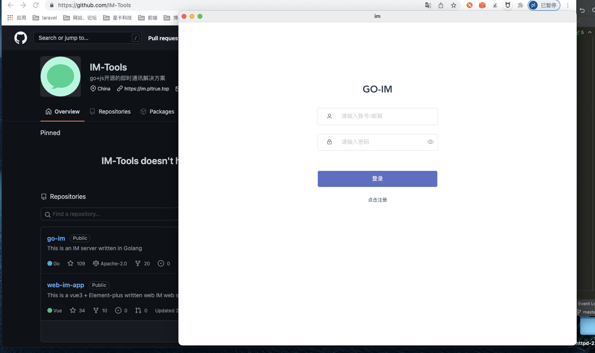
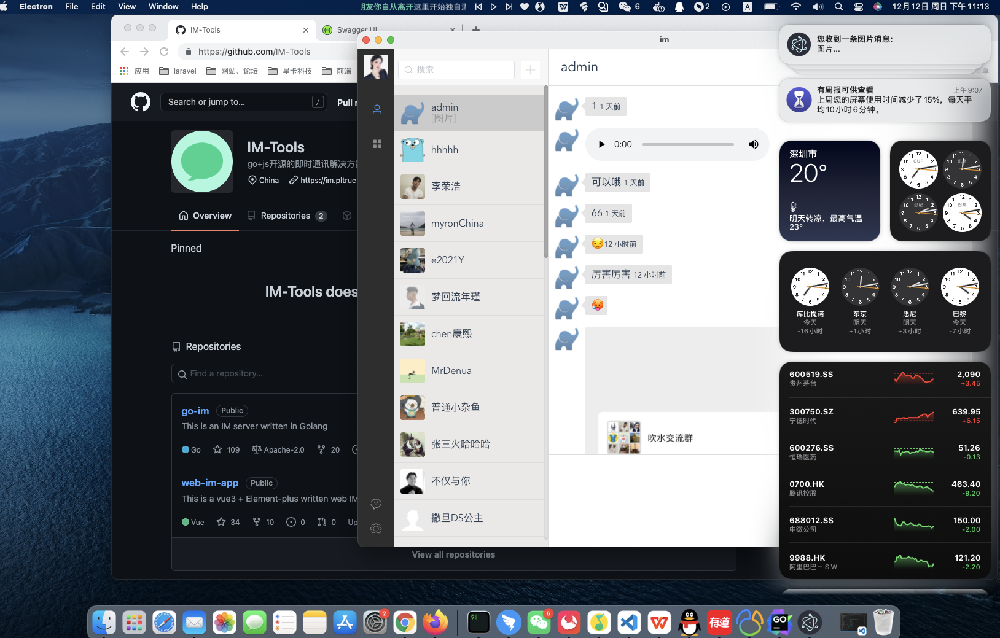

## GO-IM

 
 

> 这是一个由golang编写的高性能IM服务器 📦📦📦

#### 支持以下功能

   - [x] 支持账号密码、微博登录
   - [x] 单聊消息、群聊消息、离线消息同步
   - [x] 支持单机部署、集群部署
   - [ ] 多设备登录
   - [x] 客户端：web端、桌面应用

   
> 一些库的使用。

 * 支持cors跨域
 * 集成mysql、redis、协程池
 * jwt签名认证
 * zap日志收集
 * viper配置文件解析
 * swag接口文档生成
 * rabbitmq存储离线消息
 * 集群服务使用grpc向不同服务节点投递消息
 

   
  
#### 架构梳理

#### 桌面端

#### web登录 效果图

 
 

#### [前端源码](https://github.com/pl1998/web-im-app)
#### [桌面端](暂未开源)

#### 
  * [应用部署](/docs/1.部署文档.md)

#### 学习交流

QQ:2540463097