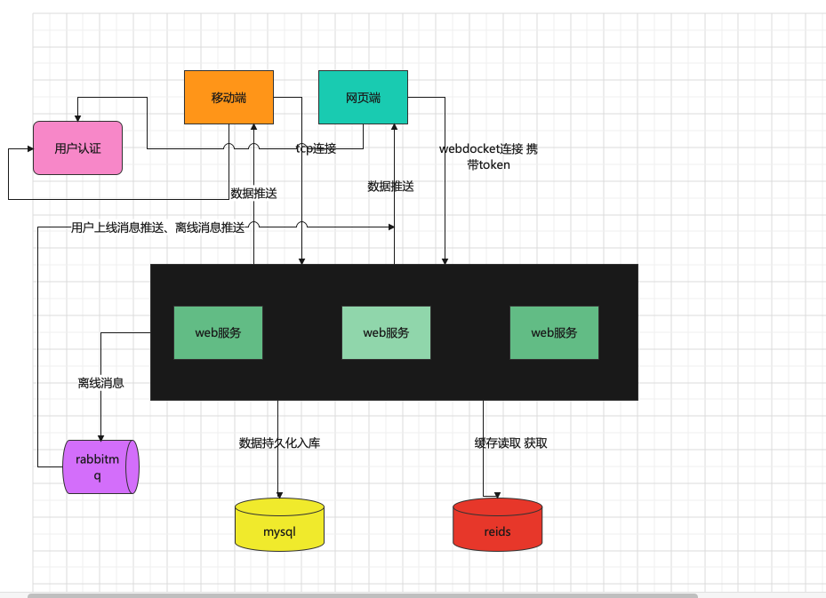

## GoIm


<br/>
<br/>

> 这是一个由golang+vue编写的web IM应用服务端 📦📦📦

#### 简单的功能
   - [x] 支持账号密码、微博登录
   - [x] 端对端消息推送、图片发送、表情包、语音发送
   - [ ] 视频功能
   - [x] rabbitmq 离线消息推送
   - [x] 创建群聊
   - [x] 群聊消息
   - [x] 响应式的前端界面支持pc与h5
   - [x] 严禁网络不良用语、过滤敏感词汇
   - [ ] 数据限流
   - [ ] 支持tcp&websocket数据交互
   
   
> 基于jwt签名验证、集成第三方登录。支持cors跨域、zap日志收集、图片、语言文件上传、垃圾词过滤、ants协程池管理、redis
 
 
> 后续需要做的:全面支持客户端消息缓存(暂时支持部分数据缓存)、梳理整体架构、并发测试、安全测试 、接口限流

#### 架构梳理


#### 目录结构
```shell
.
├── README.md
├── config
│   ├── app.go
│   ├── cache.go
│   ├── config.go
│   ├── database.go
│   └── oauth.go
├── go.mod
├── go.sum
├── im
│   ├── http
│   │   ├── controller
│   │   │   ├── auth
│   │   │   │   ├── auth.go
│   │   │   │   └── user.go
│   │   │   └── im
│   │   │       ├── group.go
│   │   │       ├── im_ws.go
│   │   │       ├── message.go
│   │   │       ├── sm_api.go
│   │   │       └── uploads.go
│   │   ├── middleware
│   │   │   └── auth.go
│   │   ├── models
│   │   │   ├── group
│   │   │   │   └── group.go
│   │   │   ├── group_user
│   │   │   │   └── group_user.go
│   │   │   ├── msg
│   │   │   │   └── msg.go
│   │   │   └── user
│   │   │       └── user.go
│   │   └── validates
│   │       ├── auth.go
│   │       ├── create_group.go
│   │       └── upload.go
│   ├── init.go
│   ├── oauth
│   │   ├── gitee.go
│   │   └── weibo.go
│   ├── service
│   │   ├── chat.go
│   │   ├── chat_struct.go
│   │   └── helper.go
│   └── utils
│       └── upload.go
├── im.sql
├── lang
│   ├── de.json
│   ├── en.json
│   ├── es.json
│   ├── jp.json
│   ├── kr.json
│   ├── loader.go
│   ├── pt.json
│   ├── tr.json
│   ├── zh-CN.json
│   └── zh-TW.json
├── main
├── main.go
├── pkg
│   ├── config
│   │   └── config.go
│   ├── helpler
│   │   └── helplers.go
│   ├── jwt
│   │   └── jwt.go
│   ├── log
│   │   ├── errors.go
│   │   └── handler.go
│   ├── model
│   │   └── model.go
│   ├── pool
│   │   └── ants_pool.go
│   ├── redis
│   │   └── redis.go
│   ├── response
│   │   └── response.go
│   └── ws
│       └── app.go
├── router
│   ├── api.go
│   └── im.go
```   
#### 效果图


 
 


#### [前端源码](https://github.com/pl1998/web-im-app)

#### 简单部署
```shell script
cp .env.example .env
go run main.go 或者 air
```

#### 启动tcp服务
```shell script
go run main.go --serve tcp-serve //启动tcp服务端
go run main.go --serve tcp-client //启动tcp客户端
```
#### 使用到的图床
```shell script
https://sm.ms/register
```
#### 功能测试
 1.使用微博登录，测试账号： admin 123456 
  
#### nginx配置实例
```shell script

  upstream websocket {
		server 127.0.0.1:9502;
	}
server
{
    listen 80;
	 listen 443 ssl http2;
    server_name im.pltrue.top;
    index index.php index.html index.htm default.php default.htm default.html;
    set $root_path '';

    if ($server_port !~ 443){
        rewrite ^(/.*)$ https://$host$1 permanent;
    }
    ssl_certificate    /www/server/panel/vhost/cert/im.pltrue.top/fullchain.pem;
    ssl_certificate_key    /www/server/panel/vhost/cert/im.pltrue.top/privkey.pem;
    ssl_protocols TLSv1.1 TLSv1.2 TLSv1.3;
    ssl_ciphers ECDHE-RSA-AES128-GCM-SHA256:HIGH:!aNULL:!MD5:!RC4:!DHE;
    ssl_prefer_server_ciphers on;
    ssl_session_cache shared:SSL:10m;
    ssl_session_timeout 10m;
    error_page 497  https://$host$request_uri;

    //访问前端
    if ( $request_uri !~* /api ) {
        set $root_path /www/wwwroot/im.pltrue.top/dist;
    }
   //访问语音文件
     if ( $request_uri ~* /voice ) {
        set $root_path /www/wwwroot/go-im;
    }
  #location /im {
  #  proxy_pass http://127.0.0.1:9502;
   # proxy_http_version 1.1;
  #  proxy_set_header Upgrade $http_upgrade;
  #  proxy_set_header Connection "upgrade";
  #}
   //访问ws
  location /im {
             proxy_pass http://127.0.0.1:9502;
             proxy_read_timeout 60s;
             proxy_set_header Host $host;
             proxy_set_header X-Real_IP $remote_addr;
             proxy_set_header X-Forwarded-for $remote_addr;
             proxy_http_version 1.1;
             proxy_set_header Upgrade $http_upgrade;
             proxy_set_header Connection 'Upgrade';
  }
   //访问接口
   location /api {
    proxy_pass http://127.0.0.1:9502;
    proxy_http_version 1.1;
    proxy_set_header Upgrade $http_upgrade;
    proxy_set_header Connection "upgrade";
   }
    root $root_path;
    #REWRITE-START URL重写规则引用,修改后将导致面板设置的伪静态规则失效
    include /www/server/panel/vhost/rewrite/admin.pltrue.top.conf;
      #REWRITE-END
    location / {
            try_files $uri $uri/ /index.html;
      }
    #禁止访问的文件或目录
    location ~ ^/(\.user.ini|\.htaccess|\.git|\.svn|\.project|LICENSE|README.md)
    {
        return 404;
    }
    
    #一键申请SSL证书验证目录相关设置
    location ~ \.well-known{
        allow all;
    }
  
    location ~ .*\.(gif|jpg|jpeg|png|bmp|swf|wav)$
    {
        expires      30d;
        error_log off;
        access_log /dev/null;
    }
    
    location ~ .*\.(js|css)?$
    {
        expires      12h;
        error_log off;
        access_log /dev/null; 
    }

    access_log  /www/wwwlogs/im.pltrue.top.log;
    error_log  /www/wwwlogs/im.pltrue.top.error.log;
}
```  
