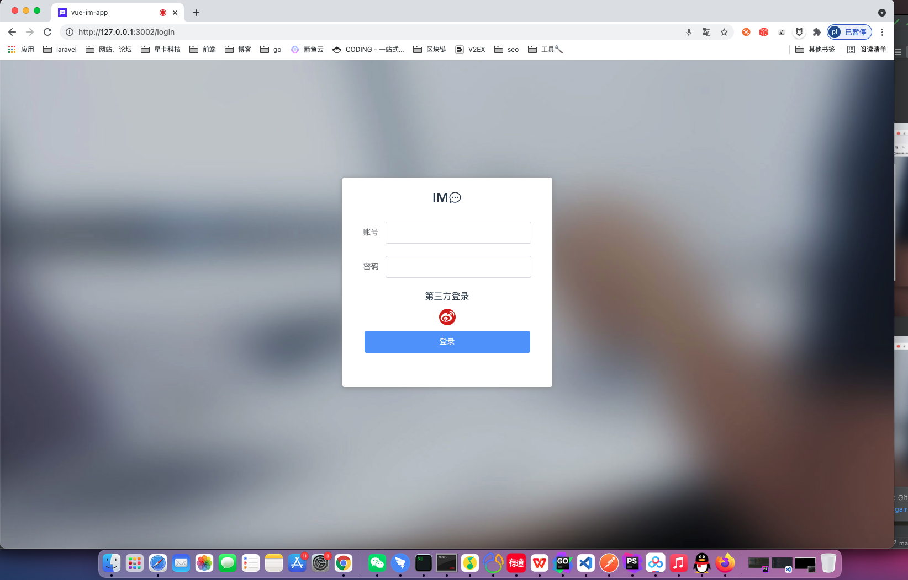
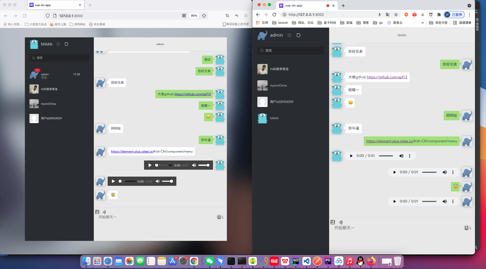
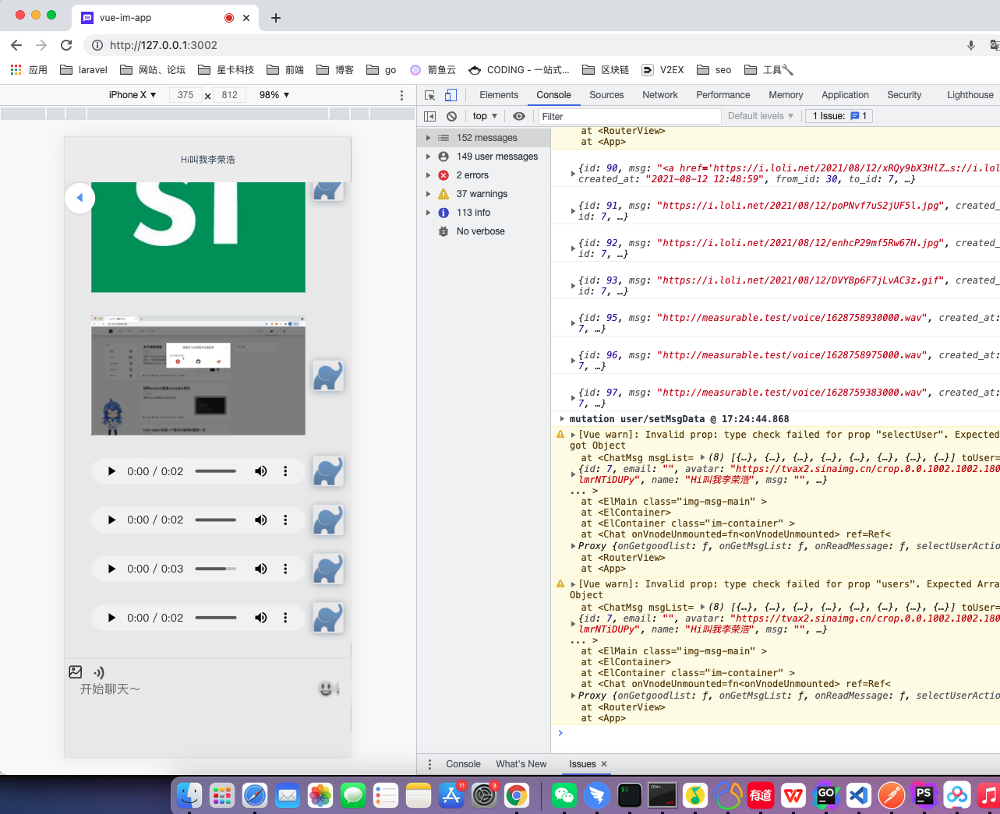

## GoIm

<p align="center">
<a href=""></a> 
</p>


> 这是一个由golang+vue编写的web IM应用服务端 📦📦📦

#### 简单的功能

   - [x] 支持微博登录
   - [x] 端对端消息推送、图片发送、表情包
   - [x] 语音功能
   - [ ] 视频功能
   - [x] 支持离线消息推送
   - [ ] 创建群聊
   - [ ] 群聊消息推送
   - [x] 离线消息推送功能
   - [x] 响应式的前端界面支持pc与h5
   
#### 效果图
  * 登录页

  * 聊天

  * h5


#### [前端源码](https://github.com/pl1998/web-im-app)cd .

#### 简单部署
```shell script
cp .env.example .env
go run main.go 或者 air
```
#### 使用到的图床
```shell script
https://sm.ms/register
```
#### 功能测试
 1.使用微博登录，测试账号： admin 123456 
  
#### nginx配置实例
```shell script

  upstream websocket {
		server 127.0.0.1:9502;
	}
server
{
    listen 80;
	 listen 443 ssl http2;
    server_name im.pltrue.top;
    index index.php index.html index.htm default.php default.htm default.html;
    set $root_path '';

    if ($server_port !~ 443){
        rewrite ^(/.*)$ https://$host$1 permanent;
    }
    ssl_certificate    /www/server/panel/vhost/cert/im.pltrue.top/fullchain.pem;
    ssl_certificate_key    /www/server/panel/vhost/cert/im.pltrue.top/privkey.pem;
    ssl_protocols TLSv1.1 TLSv1.2 TLSv1.3;
    ssl_ciphers ECDHE-RSA-AES128-GCM-SHA256:HIGH:!aNULL:!MD5:!RC4:!DHE;
    ssl_prefer_server_ciphers on;
    ssl_session_cache shared:SSL:10m;
    ssl_session_timeout 10m;
    error_page 497  https://$host$request_uri;

    //访问前端
    if ( $request_uri !~* /api ) {
        set $root_path /www/wwwroot/im.pltrue.top/dist;
    }
   //访问语音文件

     if ( $request_uri ~* /voice ) {
        set $root_path /www/wwwroot/go-im;
    }
  
  #location /im {
  #  proxy_pass http://127.0.0.1:9502;
   # proxy_http_version 1.1;
  #  proxy_set_header Upgrade $http_upgrade;
  #  proxy_set_header Connection "upgrade";
  #}
   //访问ws
  location /im {
             proxy_pass http://127.0.0.1:9502;
             proxy_read_timeout 60s;
             proxy_set_header Host $host;
             proxy_set_header X-Real_IP $remote_addr;
             proxy_set_header X-Forwarded-for $remote_addr;
             proxy_http_version 1.1;
             proxy_set_header Upgrade $http_upgrade;
             proxy_set_header Connection 'Upgrade';
  }
   //访问接口
   location /api {
    proxy_pass http://127.0.0.1:9502;
    proxy_http_version 1.1;
    proxy_set_header Upgrade $http_upgrade;
    proxy_set_header Connection "upgrade";
   }
    root $root_path;
    #REWRITE-START URL重写规则引用,修改后将导致面板设置的伪静态规则失效
    include /www/server/panel/vhost/rewrite/admin.pltrue.top.conf;
      #REWRITE-END
    location / {
            try_files $uri $uri/ /index.html;
      }
    #禁止访问的文件或目录
    location ~ ^/(\.user.ini|\.htaccess|\.git|\.svn|\.project|LICENSE|README.md)
    {
        return 404;
    }
    
    #一键申请SSL证书验证目录相关设置
    location ~ \.well-known{
        allow all;
    }
  
    location ~ .*\.(gif|jpg|jpeg|png|bmp|swf|wav)$
    {
        expires      30d;
        error_log off;
        access_log /dev/null;
    }
    
    location ~ .*\.(js|css)?$
    {
        expires      12h;
        error_log off;
        access_log /dev/null; 
    }

    access_log  /www/wwwlogs/im.pltrue.top.log;
    error_log  /www/wwwlogs/im.pltrue.top.error.log;
}
```  
