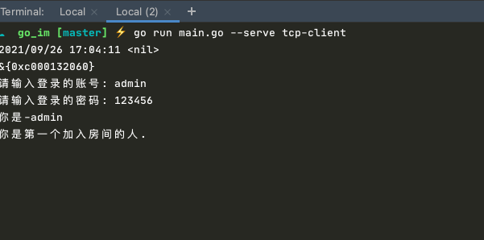

## GoIm


<p align="center">

</p>
<br/>
<br/>

> 这是一个由golang+vue编写的web IM应用服务端 📦📦📦

#### 简单的功能
   - [x] 支持账号密码、微博登录
   - [x] 端对端消息推送、图片发送、表情包、语音发送
   - [ ] 视频功能
   - [x] rabbitmq 离线消息推送
   - [x] 创建群聊
   - [x] 群聊消息
   - [x] 响应式的前端界面支持pc与h5
   - [x] 严禁网络不良用语、过滤敏感词汇
   - [x] 支持tcp命令行登录
   - [ ] 数据限流
   - [ ] 支持tcp&websocket数据交互(这点不难 解决方案待调整 用户登录时更新设备端的状态)


> 基于gin框架搭建的im服务端应用，支持cors跨域、集成mysql,redis,协程,池、jwt签名认证、zap日志收集、viper配置文件解析
   
   

#### 架构梳理


#### web登录 效果图


 
 


#### [前端源码](https://github.com/pl1998/web-im-app)


#### 启动http服务
```shell script
cp .env.example .env
go run main.go 或者 air
```

#### 启动tcp服务
```shell script
go run main.go --serve tcp-serve  //启动tcp服务端
go run main.go --serve tcp-client //启动tcp客户端
```
 启动后输入账号密码登录
 


#### 使用到的图床
```shell script
https://sm.ms/register
```
#### 功能测试
 1.使用微博登录，测试账号： admin 123456 
  
#### nginx配置实例
```shell script

  upstream websocket {
		server 127.0.0.1:9502;
	}
server
{
    listen 80;
	 listen 443 ssl http2;
    server_name im.pltrue.top;
    index index.php index.html index.htm default.php default.htm default.html;
    set $root_path '';

    if ($server_port !~ 443){
        rewrite ^(/.*)$ https://$host$1 permanent;
    }
    ssl_certificate    /www/server/panel/vhost/cert/im.pltrue.top/fullchain.pem;
    ssl_certificate_key    /www/server/panel/vhost/cert/im.pltrue.top/privkey.pem;
    ssl_protocols TLSv1.1 TLSv1.2 TLSv1.3;
    ssl_ciphers ECDHE-RSA-AES128-GCM-SHA256:HIGH:!aNULL:!MD5:!RC4:!DHE;
    ssl_prefer_server_ciphers on;
    ssl_session_cache shared:SSL:10m;
    ssl_session_timeout 10m;
    error_page 497  https://$host$request_uri;

    //访问前端
    if ( $request_uri !~* /api ) {
        set $root_path /www/wwwroot/im.pltrue.top/dist;
    }
   //访问语音文件
     if ( $request_uri ~* /voice ) {
        set $root_path /www/wwwroot/go-im;
    }
  #location /im {
  #  proxy_pass http://127.0.0.1:9502;
   # proxy_http_version 1.1;
  #  proxy_set_header Upgrade $http_upgrade;
  #  proxy_set_header Connection "upgrade";
  #}
   //访问ws
  location /im {
             proxy_pass http://127.0.0.1:9502;
             proxy_read_timeout 60s;
             proxy_set_header Host $host;
             proxy_set_header X-Real_IP $remote_addr;
             proxy_set_header X-Forwarded-for $remote_addr;
             proxy_http_version 1.1;
             proxy_set_header Upgrade $http_upgrade;
             proxy_set_header Connection 'Upgrade';
  }
   //访问接口
   location /api {
    proxy_pass http://127.0.0.1:9502;
    proxy_http_version 1.1;
    proxy_set_header Upgrade $http_upgrade;
    proxy_set_header Connection "upgrade";
   }
    root $root_path;
    #REWRITE-START URL重写规则引用,修改后将导致面板设置的伪静态规则失效
    include /www/server/panel/vhost/rewrite/admin.pltrue.top.conf;
      #REWRITE-END
    location / {
            try_files $uri $uri/ /index.html;
      }
    #禁止访问的文件或目录
    location ~ ^/(\.user.ini|\.htaccess|\.git|\.svn|\.project|LICENSE|README.md)
    {
        return 404;
    }
    
    #一键申请SSL证书验证目录相关设置
    location ~ \.well-known{
        allow all;
    }
  
    location ~ .*\.(gif|jpg|jpeg|png|bmp|swf|wav)$
    {
        expires      30d;
        error_log off;
        access_log /dev/null;
    }
    
    location ~ .*\.(js|css)?$
    {
        expires      12h;
        error_log off;
        access_log /dev/null; 
    }

    access_log  /www/wwwlogs/im.pltrue.top.zaplog;
    error_log  /www/wwwlogs/im.pltrue.top.error.zaplog;
}
```  
#### .env文件配置说明

```.env
APP_NAME=GoIM #应用名称
APP_ENV=production #开发环境
APP_YM=https://im.pltrue.top/ #域名
APP_GO_COROUTINES=100000 #协程池数量
HTTP_PORT=9502 #http服务端口
TCP_PORT=8000 #tcp服务端口

LOG_ADDRESS=././logs/ #zap日志收集目录地址

#mysql相关配置
DB_HOST=127.0.0.1
DB_PORT=3306
DB_DATABASE=im
DB_USERNAME=root
DB_PASSWORD=root
DB_LOC=Asia/Shanghai

#redis相关配置
REDIS_HOST=127.0.0.1
REDIS_PORT=6379
REDIS_PASSWORD=
REDIS_DB=0
#reabbitmq 相关配置
RABBITMQ_HOST=127.0.0.1
RABBITMQ_PORT=5672
RABBITMQ_USER=guest
RABBITMQ_PASSWORD=guest

#微博授权相关配置
WEIBO_CLIENT_ID=1949419161
WEIBO_CLIENT_SECRET=38ad194c8302f42d8d6c7bc7704595e7
WEIBO_REDIRECT_URI=http://im.pltrue.top/login

#github相关配置
GITHUB_CLIENT_ID=7e22fbb0ff807dd9768b88c5e4a89b92dedf4291e62ae395e5534b6f77122dde
GITHUB_CALLBACK=http://127.0.0.1:9502/api/giteeCallBack
GITHUB_SECRET=5be9e613e923695165d6dd31cac72105a90b4413bb594aeeefa27cb7293ecab4

#jwt相关配置
JWT_SIGN_KEY=IJjkKLMNO567PQX12R-
JWT_EXPIRATION_TIME=685200
BASE64_ENCRYPT=IJjkKLMNO567PQX12RVW3YZaDEFGbcdefghiABCHlSTUmnopqrxyz04stuvw89

GITEE_API_KEY=IJjkKLMNO567PQX12RVW3YZaDEFGbcdefghiABCHlSTUmnopqrxyz04stuvw89
#本地磁盘为 file、sm(没有用到)
FILE_DISK=file
#sm图片上传服务相关配置
SM_NAME=latent
SM_PASSWORD=panliang1998
SM_TOKEN=dXqWbAPZ63hyra6yNsv63zZKW5aJNCIb
#百度应用相关配置(没有用到)
APP_YP_ID=24687895
APP_YP_KEY=0ylkkP1RL39I4uzREKrnntC92iNrSG8O
APP_YP_SECRET_KEY=kWWeaR2mebsiHF3hSbMPkWLCkpYytXSU
APP_YP_SIGN_KEY=u5*AAIq^^!PNHd4d$C5W1
```